# Lab 1 实验报告

## 练习1. 理解通过make生成执行文件的过程

### 1. 操作系统镜像文件ucore.img是如何一步一步生成的？(需要比较详细地解释Makefile中每一条相关命令和命令参数的含义，以及说明命令导致的结果)

  ucore.img生成的关键代码为：

  ```makefile
  UCOREIMG	:= $(call totarget,ucore.img)

  $(UCOREIMG): $(kernel) $(bootblock)
      $(V)dd if=/dev/zero of=$@ count=10000
      $(V)dd if=$(bootblock) of=$@ conv=notrunc
      $(V)dd if=$(kernel) of=$@ seek=1 conv=notrunc

  $(call create_target,ucore.img)
  ```
  为了分析清楚ucore.img的生成过程，我们来看每一句代码的含义：

  - 首先看第一句的定义：

    ```makefile
    UCOREIMG	:= $(call totarget,ucore.img)
    ```
    此处，将*UCOREIMG*赋值为一个makefile的$call$函数语句，call调用的变量为$totarget$，参数为$ucore.img$ 。其中，$ucore.img$为字符串常量，而$totarget$并没有在makefile中定义。仔细观察可见，在makefile文件第87行有这样一句话：

    ```makefile
    include tools/function.mk
    ```

    这句话与C语言的include类似，将tools/function.mk在该makefile中展开。*totarget*在该文件中的定义为：

    ```makefile
    totarget = $(addprefix $(BINDIR)$(SLASH),$(1))
    ```

    将各个变量展开，等价的定义为：

    ```makefile
    totarget = $(addprefix bin/, $(1))
    ```

    其中，\$(1)表示函数的第一个参数，$totarget$的意义即将\$(1)加上$bin/$前缀。

    因此，`UCOREIMG	:= $(call totarget,ucore.img)` 表示的意义即为`UCOREIMG := bin/ucore.img` 。

  - 其次看第二句的依赖项：

    ```makefile
    $(UCOREIMG): $(kernel) $(bootblock)
    ```

    此句表明，*UCOREIMG*需要$\$(kernel)$和$\$(bootblock)$作为依赖项。因此，下面首先分析二者的生成过程：

    - 对于$\$(kernel)$：

      ```makefile
      kernel = $(call totarget,kernel)

      $(kernel): tools/kernel.ld

      $(kernel): $(KOBJS)
      	@echo + ld $@
      	$(V)$(LD) $(LDFLAGS) -T tools/kernel.ld -o $@ $(KOBJS)
      	@$(OBJDUMP) -S $@ > $(call asmfile,kernel)
      	@$(OBJDUMP) -t $@ | $(SED) '1,/SYMBOL TABLE/d; s/ .* / /; /^$$/d' > $(call symfile,kernel)
      ```

      同*UCOREIMG*的定义，第一句话可被展开为：

      ```makefile
      kernel = bin/kernel
      ```

      而第二句话表明$\$(kernel)$需要$tools/kernel.ld$作为依赖项。

      接下来一句话表明$\$(kernel)$需要*\$(KOBJS)*作为依赖项，而它的定义如下：

      ```makefile
      KOBJS	= $(call read_packet,kernel libs)
      ```

      而$read\_packet$也在$tools/function.mk$中被定义：

      ```makefile
      read_packet = $(foreach p,$(call packetname,$(1)),$($(p)))
      ```

      $packetname$定义如下：

      ```makefile
      packetname = $(if $(1),$(addprefix $(OBJPREFIX),$(1)),$(OBJPREFIX))
      ```

      而在*KOBJS*执行过程中，分别将字符串常量$kernel$和$libs$作为参数传入到$read\_packet$函数中，并将最终的结果以空格为间隔拼接。以$kernel$参数为例：

      ```makefile
      packetname = $(if kernel,$(addprefix $(OBJPREFIX),kernel),$(OBJPREFIX))
      		  = $(OBJPREFIX)kernel
      		  = __objs_kernel
      read_packet	= $(foreach p,__objs_kernel),$($(p)))
      			= $(__objs_kernel)
      			= obj/kern/init/init.o obj/kern/libs/readline.o obj/kern/libs/stdio.o obj/kern/debug/kdebug.o obj/kern/debug/kmonitor.o obj/kern/debug/panic.o obj/kern/driver/clock.o obj/kern/driver/console.o obj/kern/driver/intr.o obj/kern/driver/picirq.o obj/kern/trap/trap.o obj/kern/trap/trapentry.o obj/kern/trap/vectors.o obj/kern/mm/pmm.o
      ```

      因此，*KOBJS*最终表示的是在$kernel$和$libs$文件夹下生成的$.o$文件的所有路径，以空格分隔开。即：

      ```makefile
      KOBJS	= obj/kern/init/init.o obj/kern/libs/readline.o obj/kern/libs/stdio.o obj/kern/debug/kdebug.o obj/kern/debug/kmonitor.o obj/kern/debug/panic.o obj/kern/driver/clock.o obj/kern/driver/console.o obj/kern/driver/intr.o obj/kern/driver/picirq.o obj/kern/trap/trap.o obj/kern/trap/trapentry.o obj/kern/trap/vectors.o obj/kern/mm/pmm.o obj/libs/printfmt.o obj/libs/string.o
      ```

      而在$\$(kernel)$的command代码区，*\$@*表示对目标集合依次取出执行，此处目标集合$\$(kernel)$恰好只有字符串常量$bin/kernel$。故各个代码展开如下：

      ```makefile
      bin/kernel: $(KOBJS)
      	@echo + ld bin/kernel
      	$(V)$(LD) $(LDFLAGS) -T tools/kernel.ld -o bin/kernel $(KOBJS)
      	@$(OBJDUMP) -S bin/kernel > $(call asmfile,kernel)
      	@$(OBJDUMP) -t bin/kernel | $(SED) '1,/SYMBOL TABLE/d; s/ .* / /; /^$$/d' > $(call symfile,kernel)
      ```

      其中，$asmfile$会将传入的字符串参数转化为$.asm$的形式，$symfile$同理。即：

      ```makefile
      $(call asmfile,kernel)	= obj/kernel.asm
      $(call symfile,kernel)	= obj/kernel.sym
      ```

      因此，$\$(kernel)$的command代码区最终各段的含义为：

      ```makefile
      bin/kernel: $(KOBJS)
      	@echo + ld bin/kernel
      	# 单纯在屏幕上打印字符串"+ ld bin/kernel"
      	@$(LD) $(LDFLAGS) -T tools/kernel.ld -o bin/kernel $(KOBJS)
      	# ld命令进行链接，-T表示指定的链接脚本， -o表示输出文件， $(KOBJS)为被链接的文件
      	# $(LDFLAGS)的定义如下：
      	# LDFLAGS	:= -m $(shell $(LD) -V | grep elf_i386 2>/dev/null)
      	# LDFLAGS	+= -nostdlib
      	# 在课程提供的虚拟机中，LDFLAGS = -m    elf_i386 -nostdlib，其含义为：
      	# -m elf_i386表示生成elf_i386格式的文件
      	# -nostdlib表示仅搜索那些在命令行上显式指定的库路径，在链接脚本中(包含在命令行上指定的链接脚本)指定的库路径都被忽略
      	@$(OBJDUMP) -S bin/kernel > obj/kernel.asm
      	# 执行objdump命令将上一步链接得到的二进制文件反汇编，-S表示反汇编代码和源代码交替显示，输出到obj/kernel.asm中
      	@$(OBJDUMP) -t bin/kernel | sed '1,/SYMBOL TABLE/d; s/ .* / /; /^$$/d' > obj/kernel.sym
      	# 执行objdump命令-t显示bin/kernel文件的符号表列表，将该输出作为下一条命令的输入；
      	# 下一条sed命令表示将第一行到SYMBOL TABLE所在的行都删除，接着将每行所有“空格+字符+空格”替换为空格（此时符号表中每行只有“地址+空格+名字”）；接着删除所有的空行（$$在makefile中用于表示shell输出的$，即进行了转义）；
      	# 最终将输出保存到obj/kernel.sym中表示kernel的符号表。
      ```

    - 对于$\$(bootblock)$：

      ```makefile
      bootblock = $(call totarget,bootblock)

      $(bootblock): $(call toobj,$(bootfiles)) | $(call totarget,sign)
      	@echo + ld $@
      	$(V)$(LD) $(LDFLAGS) -N -e start -Ttext 0x7C00 $^ -o $(call toobj,bootblock)
      	@$(OBJDUMP) -S $(call objfile,bootblock) > $(call asmfile,bootblock)
      	@$(OBJCOPY) -S -O binary $(call objfile,bootblock) $(call outfile,bootblock)
      	@$(call totarget,sign) $(call outfile,bootblock) $(bootblock)
      ```

      各个语句与$\$(kernel)$类似，翻译后如下：

      ```makefile
      bootblock = bin/bootblock

      bin/bootblock: obj/boot/bootasm.o obj/boot/bootmain.o | bin/sign
      	@echo + ld $@
      	# 输出ld bin/bootblock
      	$(V)$(LD) $(LDFLAGS) -N -e start -Ttext 0x7C00 $^ -o obj/bootblock.o
      	# ld指令，LDFLAGS与kernel中类似，不再赘述。
      	# -N表示text和data节设置为可读写,取消数据节的页对齐,取消对共享库的连接
      	# -e start表示将start部分为程序的入口点
      	# -TText 0x7C00表示代码段的起始地址为0x7C00，即start部分的起始地址为0x7C00
      	# $^表示依赖项，即obj/boot/bootasm.o obj/boot/bootmain.o
      	# -o 表示输出文件为obj/bootblock.o
      	@$(OBJDUMP) -S obj/bootblock.o > obj/bootblock.asm
      	# 执行objdump命令，-S表示将代码段反汇编的同时，将反汇编代码和源代码交替显示，命令的输出保存到obj/booetblock.asm中
      	@$(OBJCOPY) -S -O binary obj/bootblock.o obj/bootblock.out
      	# 执行objcopy命令，-S表示移出所有的标志及重定位信息，-O binary表示生成二进制文件；从而将obj/bootblock.o中的代码段拷贝到bootblock.out中
      	@bin/sign obj/bootblock.out bin/bootblock
      	# 执行bin/sign文件，输入为obj/bootblock.out，输出为bin/bootblock。具体解释见下。
      ```

      注意到这里还有依赖项bin/sign，这是一个可执行文件，具体生成过程为：

      ```makefile
      $(call add_files_host,tools/sign.c,sign,sign)
      $(call create_target_host,sign,sign)
      ```

      主要工作是将`tools/sign.c`编译生成`bin/sign`文件。观察`tools/sign.c`可知，该文件的主要作用有：

      ```markdown
      1. 检查input文件是否超出510字节，超出则报错（因为只能读取第一个扇区512字节，而最终两个字节的校验位0x55AA并不属于obj/bootblock.out）。
      2. 将input文件连同校验位0x55AA输出到output文件中。
      ```

  - 最后看`UCOREIMG`的makefile command部分：

    ```makefile
    UCOREIMG	:= bin/ucore.img

    bin/ucore.img: bin/kernel bin/bootblock
        $(V)dd if=/dev/zero of=$@ count=10000
        # 创建一个大小为10000个block（每个block有512字节）的全零文件bin/ucore.img
        $(V)dd if=bin/bootblock of=$@ conv=notrunc
        # 将bin/bootblock文件拷贝到bin/ucore.img中，conv=notrunc意思为不截短地拷贝，即把bin/ucore.img中最前面的字节拷贝为bin/bootblock，而后面的零依然保留，总大小依然为10000个block.
        $(V)dd if=bin/kernel of=$@ seek=1 conv=notrunc
        # 将bin/kernel不截短地拷贝到bin/ucore.img，seek=1表示从开头跳过1个block再开始拷贝（因为bin/bootblock最多只占一个block）
    ```
  - 综上所述，ucore.img的主要生成过程为：

    ```markdown
    1. 使用gcc编译源码，生成对应的.o文件。
    2. 生成内核文件bin/kernel，具体步骤为：
      2.1 链接生成的.o文件，生成内核镜像bin/kernel
      2.2 将bin/kernel反汇编输出到obj/kernel.asm中
      2.3 将bin/kernel中的符号表处理后输出到obj/kernel.sym中
    3. 生成bootloader文件bin/bootblock，具体步骤为：
      3.1 链接生成的.o文件，生成obj/bootblock.o，并设置代码段的起始地址为0x7C00
      3.2 将上一步生成的obj/bootblock.o拷贝为二进制代码，输出到obj/bootblock.out中
      3.3 检查obj/bootblock.out的大小是否超过一个扇区（确切地说是510字节，因为有校验位），并且对该文件增加0x55AA校验位，将最终的二进制文件输出到bin/bootblock中
    4. 生成ucore.img：
      4.1 初始化ucore.img为10000个block的全零文件
      4.2 将bootloader对应的代码写入第一个block中
      4.3 将内核代码从第二个block开始写入到ucore.img中
    ```


### 2. 一个被系统认为是符合规范的硬盘主引导扇区的特征是什么？ 

  通过上一问的分析（主要是观察tools/sign.c文件中的代码），可知特征为：

  ```markdown
  1. 大小为512字节。具体地，主引导扇区中由源代码生成的文件的大小（对应于obj/bootblock.out)不得超过510字节。
  2. 最后两个字节为校验位0x55AA。
  ```


## 练习2. 使用qemu执行并调试lab1中的软件

### 1. 从CPU加电后执行的第一条指令开始，单步跟踪BIOS的执行。 

删除tools/gdbinit中的continue指令取消gdb开启后自动continue运行，执行make debug后如下：

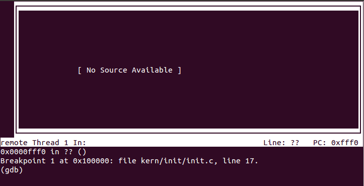

由于GDB的问题，上图指令位置其实是错误的。执行`info reg`命令查看寄存器：

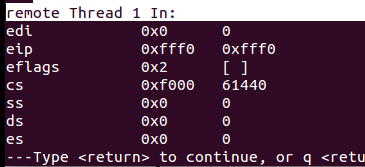

如上图可知，此时`cs=0xf000, eip=0xfff0`，因此在8086机器上，起始指令位置为`cs<<4 + eip = 0xffff0`。而在80386以后的机器中，起始地址为`0xfffffff0`。

起始地址到底在哪里呢？事实上，在80386以前的机器中，起始地址就是上面所说的`0xffff0`。而在80386以后的机器中，CS寄存器有两个部分：可见的selector和隐含的base。在实模式下，一般而言，`base = selector<<4`，但在机器刚启动时，`selector=0xf000, base=0xffff0000`，而实模式下地址永远等于`base + eip`，因此在机器刚启动时，初始地址为`0xfffffff0`。但为了保持向下兼容，在执行完第一条长跳转指令（见下图）后，CS寄存器中隐含的base部分会被改为`0xf0000 = selector << 4`，从而回到了正常的实模式。这样的做法的原因在于，初始地址依然位于内存空间最高的部分，而跳转后回到了8086的初始位置，既保证了内存不被割裂，又保证了向下兼容。

实际上，由于南桥芯片拥有一张地址映射表，`0xffff0`和`0xfffffff0`的地址寻址请求都会被映射到BIOS中的同一个位置（详情见：[基于Intel 80×86 CPU的IBM PC及其兼容计算机的启动流程](https://yq.aliyun.com/articles/15221)）。

执行`set arch i8086`命令使得gdb运行在16位模式下。查看这两个地址中的指令，可以看到是一模一样的：

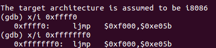

因此，执行这条指令时，便会通过长跳指令跳转至`0xfe05b`处。

在gdb中执行`si`命令后，得到下图：

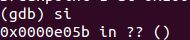

令人奇怪的是，gdb中显示的指令位置在`0xe05b`处。通过`info reg`查看寄存器：

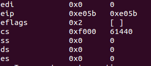

可知此时`cs=0xf000, eip=0xe05b`，因此指令位置在`0xfe05b`处。故猜测是gdb显示指令位置的问题。

### 2. 在初始化位置0x7c00设置实地址断点,测试断点正常。

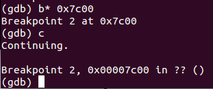

如图可知断点正常。

### 3. 从0x7c00开始跟踪代码运行,将单步跟踪反汇编得到的代码与bootasm.S和bootblock.asm进行比较。

单步跟踪反汇编如下：

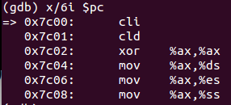

通过练习1的分析可知，bootblock.asm是由编译+反汇编生成的，其中源码与反汇编代码交替出现，而在bootasm.S中是源码，gdb查看的也是反汇编代码。因此，他们之间的差别在于：

```markdown
1. bootasm.S和bootblock.asm中的源码是32位的汇编代码，gcc编译时需要制定-m32命令。
2. gdb查看的反汇编代码和bootblock.asm中的反汇编代码是通过机器码生成的反汇编代码。其中gdb中由于执行了set arch i8086，其中的代码既有16位汇编也有32位汇编（猜测是因为gdb对i8086的支持不好），而bootblock.asm中的反汇编代码为32位汇编指令。一个较明显的差别见下图的ljmp指令、lgdtl与lgdtw指令：
```


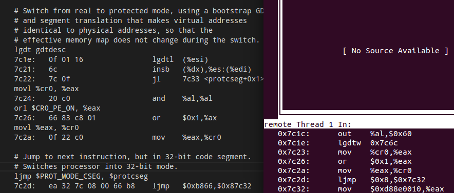

### 4. 自己找一个bootloader或内核中的代码位置，设置断点并进行测试。

测试kern_init函数中的print_kerninfo，如下图，可知断点正常：

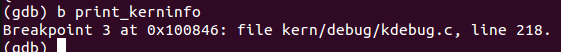

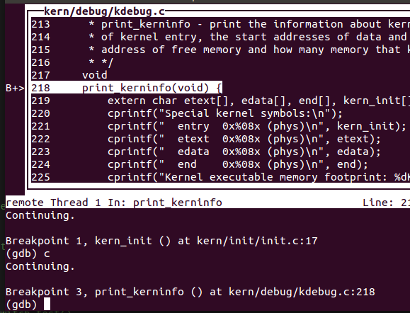


## 练习3. 分析bootloader进入保护模式的过程

### 1.为何开启A20，以及如何开启A20？

- A20即为第21条地址线。实模式下最大寻址空间为`0xffff0 + 0xffff`，超出了1MB的空间，在8086机器中由于只有20根地址线，可以自动取模进行回卷。但在80286及以后的机器上，超出了20根地址线，实模式下最大的地址不会再次回到1MB空间内。因此为了向下兼容，需要在实模式下关闭A20来提供模拟的“回卷”操作（即置A20为0，保证地址线的第21位恒为零）。
- 开启原因：

    ```
    保证从实模式进入到保护模式时，系统可以访问全部的4GB内存。（否则第21位恒为零，只能访问0-1M，2-3M，4-5M...的内存）
    ```

- 开启方式：

  控制A20的方式是将A20与键盘控制器8042的一个管脚进行与操作，因此只需要将键盘控制器的这个管脚中恒定输出1即可。但实际上，当我们准备向8042的输入缓冲区里写数据时，可能里面还有其它数据没有处理，所以，我们要首先禁止键盘操作，同时等待数据缓冲区中没有数据以后，才能真正地去操作8042打开或者关闭
  A20。在bootasm.s中，操作如下：

  ```markdown
  1. 等待8042直到输入缓冲区为空；
  2. 发送Write 8042 Output Port （P2）命令到8042的输入缓冲区；（0xd1 -> port 0x64）
  3. 等待8042直到输入缓冲区为空；
  4. 将8042 Output Port（P2）的第2个bit置1（即设置P2为11011111），然后写入60h端口。（0xdf -> port 0x60）
  ```

  ​

### 2. 如何初始化GDT表？

在bootasm.S中，通过lgdt指令加载GDT表。GDT表在汇编中硬编码，相关代码如下：

```assembly
lgdt gdtdesc

/* Normal segment */
#define SEG_NULLASM                                             \
    .word 0, 0;                                                 \
    .byte 0, 0, 0, 0

#define SEG_ASM(type,base,lim)                                  \
    .word (((lim) >> 12) & 0xffff), ((base) & 0xffff);          \
    .byte (((base) >> 16) & 0xff), (0x90 | (type)),             \
        (0xC0 | (((lim) >> 28) & 0xf)), (((base) >> 24) & 0xff)

/* Application segment type bits */
#define STA_X       0x8     // Executable segment
#define STA_E       0x4     // Expand down (non-executable segments)
#define STA_C       0x4     // Conforming code segment (executable only)
#define STA_W       0x2     // Writeable (non-executable segments)
#define STA_R       0x2     // Readable (executable segments)
#define STA_A       0x1     // Accessed

# Bootstrap GDT
.p2align 2                                          # GDT要求四字节对齐
gdt:
    SEG_NULLASM                                     # null seg
    SEG_ASM(STA_X|STA_R, 0x0, 0xffffffff)           # code seg for bootloader and kernel
    SEG_ASM(STA_W, 0x0, 0xffffffff)                 # data seg for bootloader and kernel

gdtdesc:
    .word 0x17                                      # sizeof(gdt) - 1
    .long gdt                                       # address gdt
```

gdtdesc中，前两个字节`0x17`表示GDT表共24个字节，而每个段有8个字节，因此这里一共有3个段。而`.long gdt`这四个字节表示GDT表的地址。

在GDT表中，三个段分别为空段（因为全局描述符表的第一项是不能被CPU使用，当一个段寄存器被加载一个空选择子时，处理器并不会产生一个异常。但是，当用一个空选择子去访问内存时，则会产生异常。）、bootloader和kernel的代码段、bootloader和kernel的数据段。

**需要注意的是，这里尽管开启了段机制，但地址转换为恒等映射。**

此外，在bootasm.S中，定义了保护模式下kernel的代码段和数据段的选择子：

```assembly
.set PROT_MODE_CSEG,        0x8                     # kernel code segment selector
.set PROT_MODE_DSEG,        0x10                    # kernel data segment selector
```

这是因为，index分别为1或10（二进制），表指示位和RPL都为0，因此两个选择子分别为1000和10000，即0x8和0x10.

### 3. 如何使能，如何进入保护模式？

进入保护模式的步骤为：

```assembly
1. 加载GDT（上问已经分析）。
2. 设置CR0的保护允许位PE（即最低位）为1。做法如下，即取出CR0寄存器，然后将其与0x1进行或操作：

    .set CR0_PE_ON,             0x1

    movl %cr0, %eax
    orl $CR0_PE_ON, %eax
    movl %eax, %cr0

3. 开始执行32位指令：

	ljmp $PROT_MODE_CSEG, $protcseg
	
	执行这条长跳转指令后，CS寄存器会被设置为代码段选择子$PROT_MODE_CSEG，从而真正进入32位保护模式。而protcseg代码如下：
	
	.code32                                             # Assemble for 32-bit mode
protcseg:
    # Set up the protected-mode data segment registers
    movw $PROT_MODE_DSEG, %ax                       # Our data segment selector
    movw %ax, %ds                                   # -> DS: Data Segment
    movw %ax, %es                                   # -> ES: Extra Segment
    movw %ax, %fs                                   # -> FS
    movw %ax, %gs                                   # -> GS
    movw %ax, %ss                                   # -> SS: Stack Segment

    # Set up the stack pointer and call into C. The stack region is from 0--start(0x7c00)
    movl $0x0, %ebp
    movl $start, %esp
    call bootmain
    
    可见这里设置了数据选择子并将各个段寄存器初始化为内核数据选择子。紧接着，初始化ebp为0，并将esp初始化为start（即0x7C00)，建立好当前bootloader所在的初始化的栈。最后调用bootmain，执行bootloader的主要代码。
```


## 练习4. 分析bootloader加载ELF格式的OS的过程 

### 1. bootloader如何读取硬盘扇区的？

在bootmain.c中，相关函数为：

```c
/* readsect - read a single sector at @secno into @dst */
static void
readsect(void *dst, uint32_t secno) {
    // wait for disk to be ready
    waitdisk();

    outb(0x1F2, 1);                         // count = 1
    outb(0x1F3, secno & 0xFF);
    outb(0x1F4, (secno >> 8) & 0xFF);
    outb(0x1F5, (secno >> 16) & 0xFF);
    outb(0x1F6, ((secno >> 24) & 0xF) | 0xE0);
    outb(0x1F7, 0x20);                      // cmd 0x20 - read sectors

    // wait for disk to be ready
    waitdisk();

    // read a sector
    insl(0x1F0, dst, SECTSIZE / 4);
}
```

因此，大致步骤为：

```markdown
1. 等待磁盘准备好。
2. 向硬盘0x1F2写入要读取的扇区数（即1）。
3. 将要读的扇区号写入硬盘相应的寄存器。
4. 发出读扇区的命令。
5. 等待硬盘读取完毕。
6. 读取硬盘。需要注意的是insl的单位为4字节，因此传入的参数为SECTSIZE / 4。
```


### 2. bootloader是如何加载ELF格式的OS？

相关函数为：

```c
/* *
 * readseg - read @count bytes at @offset from kernel into virtual address @va,
 * might copy more than asked.
 * */
static void
readseg(uintptr_t va, uint32_t count, uint32_t offset) {
    uintptr_t end_va = va + count;

    // round down to sector boundary
    va -= offset % SECTSIZE;

    // translate from bytes to sectors; kernel starts at sector 1
    uint32_t secno = (offset / SECTSIZE) + 1;

    // If this is too slow, we could read lots of sectors at a time.
    // We'd write more to memory than asked, but it doesn't matter --
    // we load in increasing order.
    for (; va < end_va; va += SECTSIZE, secno ++) {
        readsect((void *)va, secno);
    }
}

/* bootmain - the entry of bootloader */
void
bootmain(void) {
    // read the 1st page off disk
    readseg((uintptr_t)ELFHDR, SECTSIZE * 8, 0);

    // is this a valid ELF?
    if (ELFHDR->e_magic != ELF_MAGIC) {
        goto bad;
    }

    struct proghdr *ph, *eph;

    // load each program segment (ignores ph flags)
    ph = (struct proghdr *)((uintptr_t)ELFHDR + ELFHDR->e_phoff);
    eph = ph + ELFHDR->e_phnum;
    for (; ph < eph; ph ++) {
        readseg(ph->p_va & 0xFFFFFF, ph->p_memsz, ph->p_offset);
    }

    // call the entry point from the ELF header
    // note: does not return
    ((void (*)(void))(ELFHDR->e_entry & 0xFFFFFF))();

bad:
    outw(0x8A00, 0x8A00);
    outw(0x8A00, 0x8E00);

    /* do nothing */
    while (1);
}
```

readseg函数逐个读取磁盘，读取硬盘中的一段数据。需要注意的是必须跳过主引导扇区，因此kernel从1号扇区开始。

bootmain函数中读取第一个页，即ELF头，然后判断ELF的合法性；接着对程序节进行遍历加载即可。

需要注意的是，ELF头中有内核的入口点的地址，最终将程序跳转到这个入口，将控制权转移给操作系统，从而完成了操作系统的加载。


## 练习5. 实现函数调用堆栈跟踪函数

### 1. 实现过程？

通过对注释翻译成代码即可，本质原理为ebp保存了一条关于栈底的链表，而在压栈前后参数的顺序是固定的，从而知道ebp后即可知道所有的参数。这里有几个需要仔细思考的问题：

1. 观察代码可知，`read_ebp`为内联函数，而`read_eip`并非内联函数，这样做的意义是？

   ```markdown
   1. 内联函数即可在编译中直接转换成对应的汇编代码，从而读取的ebp值即为调用该函数时的ebp。具体而言，即为print_stackframe函数堆栈中的ebp。此时该ebp保存了上一个栈的ebp，ebp+4为print_stackframe的返回地址，ebp+8,12,16,20分别为需要输出的4个参数（实际上参数没有那么多）。

   2. 非内联函数read_eip读取的是调用read_eip时的当前eip的值。其原理为，调用read_eip后，由于非内联函数，需要进行压栈，因此在当前堆栈中压入return address和old ebp，并将ebp指向old ebp。而read_eip将ebp+4赋值给函数临时变量eip，即把read_eip的return address赋值给了这个临时变量。由于return address恰好为调用read_eip返回后的下一条指令的地址，恰好为调用read_eip时候的eip寄存器的值。这个做法利用了堆栈切换得到eip寄存器的值，是十分巧妙的。
   ```

2. 如何通过C语言的临时变量来访问相应的堆栈？

   ```
   将临时变量转化为指针即可。需要注意的是，转化为指针后，所有的+4、+8操作都需要转化为+1、+2。再通过*操作访问对应地址的数据。
   ```

3. 能否通过`movl %ebp %esp, popl %ebp`来实现堆栈的回溯？

   ```
   不能。因为这样会改变当前函数的堆栈，导致无法正确返回。
   ```

4. 为什么调用`print_debuginfo(eip - 1)`时需要传入`eip-1`？

   ```
   eip的值永远都是当前堆栈函数的返回地址，即在当前堆栈函数的父函数中，调用该函数后的下一个语句。为了定位当前函数，需要减去一个适当的值来回到该函数的地址。
   需要注意的是，x86指令是变长的，因此我们很难确定减去多少才能回到刚好调用该函数的指令的起始地址。一个折中的办法是打印eip-1处的信息，也可以定位到该指令。
   事实上，经过测试，传入eip-2、eip-3、eip-4都可以打印正确的信息，而传入eip-5可以打印大部分正确的信息。
   ```

5. 在堆栈回溯时，先更新ebp的值还是先更新eip的值？

   ```
   eip。因为eip在初始调用read_eip时读取的是print_stackframe函数内部运行时eip的值，而通过return address定位的是父函数调用子函数时的指令地址，因此需要先更新eip才能知道父函数调用print_stackframe时的eip，否则若先更新ebp，再更新eip，则得到的是父函数的父函数调用父函数时的eip，无法正确对应。
   ```

### 2. 解释最后一行各个数值的含义

最后一行为：

```
ebp:0x7bf8 eip:0x7d68 args:0xc031fcfa 0xc08ed88e 0x64e4d08e 0xfa7502a8                           
    <unknow>: -- 0x00007d67 --         
```

这是在设置ebp为0时第一个被调用的函数，在练习3中最后一问的分析已经指出，调用的函数为bootmain。

对于ebp，由于在调用bootmain之前将esp设置为0x7c00，因此压栈时，0x7bfc存着bootmain的返回地址（即跳转指令），而0x7bf8存的是上一级ebp（即0）。

此外，由于bootmain没有参数，因此四个“参数”实际上是调用bootmain之前栈上的值，即当栈顶esp为0x7c00时栈顶的四个值，即位于0x7c00~0x7c0f处的代码。查看bootblock.asm，可知这一结论成立（注意x86是小端）：

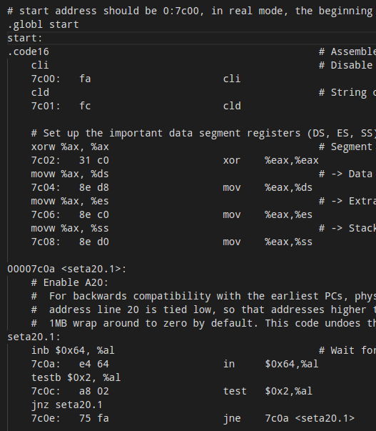


## 练习6. 完善中断初始化和处理

### 1.中断描述符表（也可简称为保护模式下的中断向量表）中一个表项占多少字节？其中哪几位代表中断处理代码的入口？

一个表项占8字节，中断处理代码的代码段选择子在描述符的16~31位，段偏移的第0~15位在描述符的第0~15位，段偏移的第16~31位在描述符的第48~63位。

### 2. 完善kern/trap/trap.c中对中断向量表进行初始化的函数idt_init。

事实上只需要通过注释+gitbook上的说明即可实现该练习。需要注意的是SETGATE时的参数设置：

1. trap的设置：对于用户主动陷入的中断，需要设置trap描述，即对于T_SYSCALL需要设置trap=1，其余都为0.

   需要注意的是，在扩展练习1中为了获取时钟计数的值，要在进入T_SWITCH_OK后屏蔽时钟中断，因此尽管是用户态的中断，仍然需要trap设置为0.

2. sel的设置：段选择子，由于中断处理程序都在内核态，因此设置段选择子为内核态的代码段的段选择子。

3. DPL的设置：对于用户态调用的中断，需要设置DPL为用户态权限，即T_SYSCALL和扩展练习一中的T_SWITCH_TOK需要设置DPL=3.

本题参考答案没有考虑T_SYSCALL，且考虑了扩展练习一的T_SWITCH_TOK，让我在做完练习6后看答案时产生了一定程度的困惑。

### 3. 完善trap.c中的中断处理函数trap

本题毫无难度，直接根据注释实现即可，也没有什么需要注意的地方。


## 扩展练习1

### 内核态到用户态

本题要求通过中断实现从内核态到用户态的切换，乍一听很难做到：中断要么是内核态到内核态，要么是用户态到内核态，怎么可以反向呢？事实上，我们可以想象如下场景：

​	假定用户是在打印函数lab1_print_cur_status的时候触发了中断，然后系统解决完中断后用iret回到打印函数。但现在前半句没有发生，要直接从后半句话开始，即要求操作系统通过iret回到用户态。

怎么操作呢？我们回忆一下中断发生到退出，大致的一系列操作：

```
内核态调用int，触发中断，硬件将一系列参数压栈（见下图），接着OS将一系列寄存器和其他参数压栈，接着进行中断处理，最终中断处理结束，os将压入栈的数据都恢复，接着硬件的iret指令恢复由硬件压入的栈（见下图）。
```

利用硬件的特性：

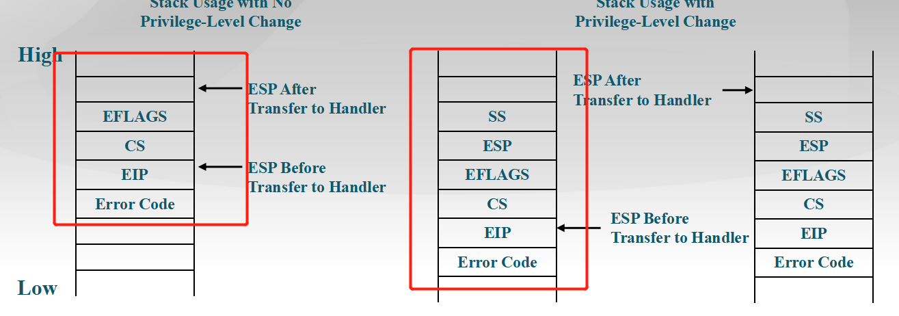

当内核态触发中断时，x86的CPU会自动在栈中压入左图中的四个参数。而在涉及到堆栈切换的iret时，会默认栈中有六个参数，其中SS和ESP即为用户态栈的数据。因此，我们要构造一个中断和一个适当的栈，满足如下条件：

```markdown
1. 该中断由内核态触发，涉及特权级转换。
2. 该中断发生时，要预先在堆栈上存好用户态的SS和ESP。
```

因此，实现起来就很简单了：只要预先留出SS和ESP的空间，然后设置好堆栈信息即可。

具体做法为：

1. 在`lab1_switch_to_user`中，完成如下操作：
   - 将esp减8，为ss和esp留出空间；
   - 调用int指令触发中断
   - 中断处理程序结束后，将当前ebp的值赋值给用户态的esp。
2. 在`trap.c`中：
   - 将trapframe的一系列参数设置好：
     - cs设置为用户代码选择子，其他段寄存器设置为用户数据选择子。
     - esp设置为`lab1_switch_to_user`的return address。
     - 设置eflags使得用户态可以进行IO输出（print函数）。
     - ss设置为一个临时的用户态栈（使用全局变量解决）。

### 用户态到内核态

方法同理，需要注意的是不需要额外预留ss和esp，因为是用户到内核态。


## 总结

### 本实验中重要的知识点，以及与对应的OS原理中的知识点

1. makefile的分析可以看出很多知识，包括镜像的生成过程，bootloader的生成过程。通过分析这些生成过程，为后续的练习分析源码找到了很多头绪。这里重要的知识点是处处体现“第一个启动扇区”，以及启动地址为0x7C00，校验位等。
2. 对第一条代码的地址有很深入的分析。
3. 对A20有很深入的分析。
4. 对GDT有很深入的分析。
5. 对中断描述符表和中断处理过程有很深入的分析。
6. 对函数堆栈有很深入的分析。
7. 对特权转换和中断堆栈切换有很深入的分析。
8. 对ELF格式以及磁盘读取有了一定的了解。

### 本实验中没有对应的

基本上都有对应，实验起到了很好的引导作用，在完成实验及报告的过程中我仔细深入地分析了源码，对OS原理的理解更深入了。